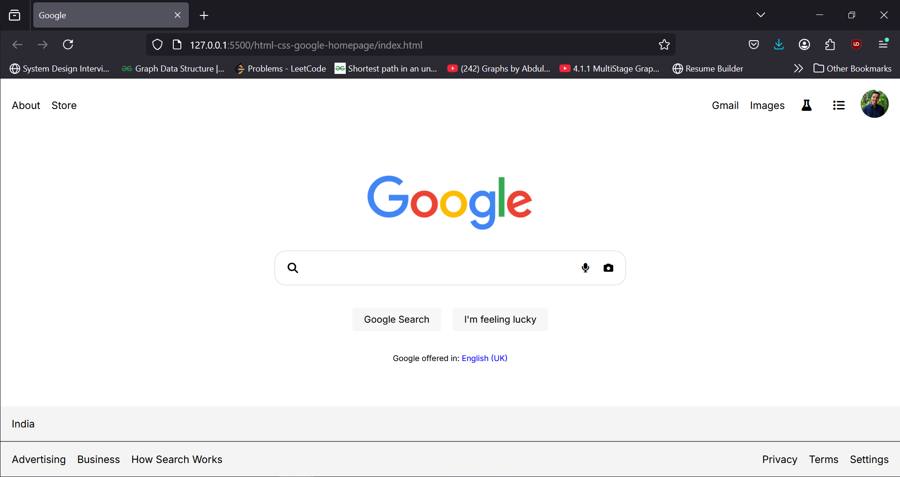

# html-css-google-homepage

Recreated the google homepage to refresh my understanding of HTML and CSS.

Final Product of the frontend:

Also deployed to a live server using netlify.

The link to access the site is: https://maniacghost-google.netlify.app/
